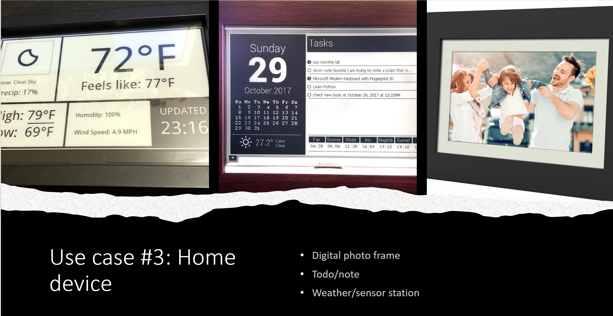

## Introduction 

Back in the end of 2021 ...
As many CS guys, I started to play with various technologies and toys. Some were really "for fun", others were for scratching my own itch. 
Some ideas were developed further during a walk or under the shower and lead to the burning of many useless hours on side projects and ideas, with the E-ink-ESP32 project is one of them.

I can remember the initiate idea was: I want to display something (an image, a graph, ...) on a monitor to help me learn vocabulary, idioms and proverbs. 
Well, living abroad kind of destroys your mother-tongue language knowledge, so the wasted time on building such tool could be justified. 

I wanted the device to be portable, simple, and cheap. I just want to setup once, and it should just work without me caring at all - everything that can make a product famous!
This rules out LCD monitors (obvious since that would require a power outlet). Buying ready-to-use products like the digital picture frame is also out of the questions not only because that would be nearly impossible for future configuration and customization, but also there existed no such cheap, battery-powered device. 

So, I am an informatiker. I can build thing! If nothing works for me, I will build one myself. 
From that moment, I started my own journey into the (high level) embedded system, because I know this is the only way to satisfy my requirements: low power, cheap.
This device should also be wireless controlled , that means WIFI/Bluetooth/ZigBee/... The selected hardware is therefor:

- Controller: ESP32: a powerful and versatile controller with excellent support and online documentation. Built-in WIFI and Bluetooth support. I use the [ESP32 Devkit C](https://www.az-delivery.de/en/products/esp-32-dev-kit-c-v4), or short _esp32dev_
- Display: E-ink display from Waveshare. Cheap enough and very easy to find.
- Wireless: LoRa. The decision to switch to LoRa (due to power consumption) comes later, which leads to throwing most of the code written for Wifi-based data transmitting.


## Vision and Status
### Vision
A system consisted of the content server, and the e-ink device.​
- Content server is responsive for preparing the content to be displayed on the e-ink device.​
- E-ink device has a microcontroller with internet-ability to fetch content from server to display on its e-ink display.​

The system can display the content for a long time without consuming the battery and remotely change them, making it suitable for unfrequently-changing content in distributed environment:​

<div style="float: left; margin-right: 20px; text-align: center;">
    
    <span style="display:block;">In-door placates</span>
</div>

<div style="float: left; text-align: center;">
    
    <span style="display:block;">Out-door info board, advertisement</span>
</div>

<div style="float: left; text-align: center;">
    
    <span style="display:block;">Smart home</span>
</div>

<div style="float: left; text-align: center;">
    
    <span style="display:block;">Name tag, door tag</span>
</div>

<div style="float: left; text-align: center;">
    
    <span style="display:block;">Industrial</span>
</div>


### Status
IoT E-Ink project with intelligent central station, capable of be deployed in mass number or in small scale for personal usage.
- Latest iteration supports short- and long-range communication over Wi-Fi, Bluetooth Low Energy (BLE) and LoRa. 
- The project requires significant work in different fields: backend and frontend for the controller; support for BLE, Wi-Fi, LoRa for ESP32 microcontroller; support for different e-ink display signal requirement, resolutions, and colours. 
- The goal was to replace LCD and paper-based display-surface where its 1. Possible to justify cost of updating content manually (paper) or infrastructure to support an LCD display or 2. Beneficial to have a dynamic content displaying device that requires insignificant maintenance.

## Challenges
A lot of problems have arose during the project duration, which were not clear in the planning phase.
Will be updated.

## Starting phase: prototype
The following code pieces were used to test individual functions of the system. 
They are:
- Communication: start the radio devices and exchange data
- Display: display data on e-ink displays.

### Sources
Many resources were used:
- https://people.csail.mit.edu/albert/bluez-intro/c212.html
- https://github.com/espressif/arduino-esp32/blob/master/libraries/BluetoothSerial/examples/SerialToSerialBT_Legacy/SerialToSerialBT_Legacy.ino
- https://deepbluembedded.com/esp32-bluetooth-classic-with-arduino-complete-guide/
- https://github.com/chandrawi/LoRaRF-Python/blob/main/examples/SX127x/receiver_timeout.py

### Prepare

Fix error: `Failed to start discovery: org.bluez.Error.NotReady`
```bash
rfkill list
# 0: hci0: Bluetooth
#         Soft blocked: yes
#         Hard blocked: no
1: phy0: Wireless LAN
        # Soft blocked: no
        # Hard blocked: no

# If soft blocked, then:
rfkill unblock all
```

### Use bluetooth from command line

Scan for ESP32 device:
```bash
pi@raspberrypi:~ $ sudo hcitool dev
Devices:
        hci0    B8:27:EB:0C:A9:AB
pi@raspberrypi:~ $ sudo hcitool scan
Scanning ...
        78:21:84:77:D8:FA       ESP32
```

Scan intensively:
```bash
sudo bluetoothctl
# Agent registered
[bluetooth]# scan on
# Discovery started
# [CHG] Controller B8:27:EB:0C:A9:AB Discovering: yes
# [NEW] Device A4:C1:38:96:85:E0 ihoment_H6179_85E0
# [NEW] Device 5E:1E:86:61:3D:38 5E-1E-86-61-3D-38
# [NEW] Device 6D:B2:AA:7B:59:22 6D-B2-AA-7B-59-22
# [NEW] Device E6:33:2D:13:BD:EA E6-33-2D-13-BD-EA
# [NEW] Device 57:D7:4F:F1:F1:31 57-D7-4F-F1-F1-31
pair 78:21:84:77:D8:FA

[bluetooth]# paired-devices
Device 78:21:84:77:D8:FA ESP32

remove 78:21:84:77:D8:FA
```

```bash
sudo apt-get install bluetooth bluez libbluetooth-dev
sudo python3 -m pip install pybluez
```


### ESP32 listens, Pi pairs simple 
```c
#include "BluetoothSerial.h"

/* Check if Bluetooth configurations are enabled in the SDK */
/* If not, then you have to recompile the SDK */
#if !defined(CONFIG_BT_ENABLED) || !defined(CONFIG_BLUEDROID_ENABLED)
#error Bluetooth is not enabled! Please run `make menuconfig` to and enable it
#endif

BluetoothSerial SerialBT;

void setup() {
  Serial.begin(115200);
  /* If no name is given, default 'ESP32' is applied */
  /* If you want to give your own name to ESP32 Bluetooth device, then */
  /* specify the name as an argument SerialBT.begin("myESP32Bluetooth"); */
  SerialBT.begin();
  Serial.println("Bluetooth Started! Ready to pair...");
}

void loop() {
  if (Serial.available()) {
    SerialBT.write(Serial.read());
  }
  if (SerialBT.available()) {
    Serial.write(SerialBT.read());
  }
  delay(20);
}
```

```python
import bluetooth
bd_addr = "78:21:84:77:D8:FA"
port = 1
sock=bluetooth.BluetoothSocket( bluetooth.RFCOMM )
sock.connect((bd_addr, port))
sock.send("hello!!")
sock.close()
```

### Pi connects and sends data periodically 

```cpp
#include "BluetoothSerial.h"

/* Check if Bluetooth configurations are enabled in the SDK */
/* If not, then you have to recompile the SDK */
#if !defined(CONFIG_BT_ENABLED) || !defined(CONFIG_BLUEDROID_ENABLED)
#error Bluetooth is not enabled! Please run `make menuconfig` to and enable it
#endif

BluetoothSerial SerialBT;
const int BUFFER_SIZE = 184;
char buffer[BUFFER_SIZE];

struct payload {
  int count;
  char message[100];
  int temps[10];
  int humids[10];
} ;

struct payload pl;

void setup() {
  Serial.begin(115200);
  /* If no name is given, default 'ESP32' is applied */
  /* If you want to give your own name to ESP32 Bluetooth device, then */
  /* specify the name as an argument SerialBT.begin("myESP32Bluetooth"); */
  SerialBT.begin();
  Serial.println("Bluetooth Started! Ready to pair...");
}

void loop() {
  if (SerialBT.available()) {
    // Read data into the buffer
    int bytesRead = SerialBT.readBytes((char *) &pl, BUFFER_SIZE);

    // Process the received data (replace this with your actual processing logic)
    if (bytesRead > 0) {
      Serial.printf("Count: %d. Received message: ", pl.count);
      Serial.write(pl.message, 100);
      Serial.println();
      for (int i = 0; i < 10; i++) {
        Serial.printf("%d ", pl.temps[i]);
      }
      Serial.println();
      for (int i = 0; i < 10; i++) {
        Serial.printf("%d ", pl.humids[i]);
      }
      Serial.println();
      
      Serial.println();
    }
  }
  delay(20);
}
```

```python
import bluetooth

import time, random, string, struct, array

## Send data in struct. 
format_string = 'I100s10i10i'
print(f"struct payload size: ${str(struct.calcsize(format_string))}")
integer_value = 42
char_array = b'Hello, World!'
int_array_1 = [1, 2, 3, 4, 5, 6, 7, 8, 9, 10]
int_array_2 = [11, 12, 13, 14, 15, 16, 17, 18, 19, 20]

bd_addr = "78:21:84:77:D8:FA"
port = 1

current_count = 0
while True:
    try:
        print("Connecting ...")
        sock=bluetooth.BluetoothSocket( bluetooth.RFCOMM )
        ret = sock.connect((bd_addr, port))
        temps = [current_count] * 10
        humids = [current_count] * 10
        packed_data = struct.pack(
            format_string, current_count, 
            char_array, *temps, *humids
            )
        print("Connected. Sending ...")
        sock.send(packed_data)
        sock.close()
        print("Done. Sleep.")
        current_count += 1
    except Exception as e:
        print("Error: ", e)
    time.sleep(5)

```

### 2 ESP32 and 1 Pi
- ESP32 A sends weather data from sensor over LoRA.
- Pi receives these data, stores in memory and periodically connects to ESP32 B and transmits processed data.
- ESP32 B receives the data from Pi over Bluetooth and prints out.

#### ESP32 A
```cpp

#include <SPI.h>
#include <LoRa.h>
#include <SPI.h>
#include "DHT.h"

// LORA: define the pins used by the transceiver module
#define ss 5
#define rst 14
#define dio0 2
// SENSOR:
#define DHTPIN 25     // Digital pin connected to the DHT sensor
#define DHTTYPE DHT22   // DHT 22  (AM2302), AM2321
DHT dht(DHTPIN, DHTTYPE);

int counter;

void setup() {
  // put your setup code here, to run once:
  Serial.begin(9600);
  dht.begin();
  Serial.println("Setup done");
  counter = 0;
}

void loop() {
  // put your main code here, to run repeatedly:
  // Reading temperature or humidity takes about 250 milliseconds!
  // Sensor readings may also be up to 2 seconds 'old' (its a very slow sensor)
  float h = dht.readHumidity();
  // Read temperature as Celsius (the default)
  float t = dht.readTemperature();
  // Read temperature as Fahrenheit (isFahrenheit = true)
  float f = dht.readTemperature(true);

  // Check if any reads failed and exit early (to try again).
  if (isnan(h) || isnan(t) || isnan(f)) {
    Serial.println(F("Failed to read from DHT sensor!"));
    delay(1000);
    return;
  }
  // Compute heat index in Celsius (isFahreheit = false)
  float hic = dht.computeHeatIndex(t, h, false);
  char resultString[100];
  // sprintf(resultString, "%d,lichtenberg,Humidity: %.2f%%, Temp: %.2fC, Heat index: %.2fC", counter, h, t, hic);
  sprintf(resultString, "%d,Lichtenberg,%.2f,%.2f,%.2f", counter, h, t, hic);
  Serial.println(resultString);


  LoRa.setPins(ss, rst, dio0);
  Serial.println("initing lora ... ");
  while (!LoRa.begin(866E6))
  {
    Serial.println(".");
    delay(500);
  }
  LoRa.setSyncWord(0xF3);
  delay(500);
  Serial.println("Sending msg: ...");
  Serial.println(resultString);
  LoRa.beginPacket();
  LoRa.printf(resultString);
  LoRa.endPacket();
  counter = counter + 1;
  Serial.println("Sent. Sleep.");
  delay(10000);

}

```

#### Pi
```python
import threading, signal
import time, random, string, struct, array, copy
import bluetooth
from LoRaRF import SX127x
from datetime import datetime

# Global variable to control thread execution
keep_running = True
data_lock = threading.Lock()

# TODO: might need to adapt "format_string" var if this list is updated
# Also update eink-esp32
remote_station_names = ["Lichtenberg", "FriedKreuz", "Mitte", "Spandau"]
data = {
    "Lichtenberg": {"humid": 99.99, "temp": 99.99, "heat_index": 99.99, "updated_at_ms": 99},
    "FriedKreuz": {"humid": 99.99, "temp": 99.99, "heat_index": 99.99, "updated_at_ms": 99},
    "Mitte": {"humid": 99.99, "temp": 99.99, "heat_index": 99.99, "updated_at_ms": 99},
    "Spandau": {"humid": 99.99, "temp": 99.99, "heat_index": 99.99, "updated_at_ms": 99},
}


def parse_lora_msg(msg):
    # usage: parse_lora_msg("37,Lichtenberg,35.80,27.20,26.8")
    # return: 
    # {'name': 'Lichtenberg', 
    # 'data': {'humid': '35.80', 'temp': '27.20', 
    # 'heat_index': '26.8', 'updated_at_ms': 1702323375488}}
    data_list = msg.split(",")
    if len(data_list) != 5:
        return None
    parsed_data = {}
    try:
        parsed_data = {
        "name": data_list[1],
        "data": {
            "humid": float(data_list[2]), 
            "temp": float(data_list[3]), 
            "heat_index": float(data_list[4]), 
            "updated_at_ms": int(time.time() * 1000)}
        }
    except Exception as e:
        print("LoRa: error: ", e)
        return None
    return parsed_data
    
def lora_worker(arg1, arg2):
    # Based on 
    # https://github.com/chandrawi/LoRaRF-Python/blob/main/examples/SX127x/receiver_timeout.py
    # This thread is very resource intensive for some reason.
    print("## Thread LoRa: started.")

    # Begin LoRa radio and set NSS, reset, busy, IRQ, txen, and rxen pin with connected Raspberry Pi gpio pins
    # IRQ pin not used in this example (set to -1). Set txen and rxen pin to -1 if RF module doesn't have one
    busId = 0; csId = 0
    resetPin = 22; irqPin = -1; txenPin = -1; rxenPin = -1
    LoRa = SX127x()
    print("Begin LoRa radio")
    if not LoRa.begin(busId, csId, resetPin, irqPin, txenPin, rxenPin) :
        raise Exception("Something wrong, can't begin LoRa radio")

    # Set frequency to 915 Mhz
    print("Set frequency to 915 Mhz")
    LoRa.setFrequency(866000000)

    # Set TX power, this function will set PA config with optimal setting for requested TX power
    print("Set TX power to +17 dBm")
    LoRa.setTxPower(17, LoRa.TX_POWER_PA_BOOST)                     # TX power +17 dBm using PA boost pin

    # Configure modulation parameter including spreading factor (SF), bandwidth (BW), and coding rate (CR)
    # Receiver must have same SF and BW setting with transmitter to be able to receive LoRa packet
    print("Set modulation parameters:\n\tSpreading factor = 7\n\tBandwidth = 125 kHz\n\tCoding rate = 4/5")
    LoRa.setSpreadingFactor(7)                                      # LoRa spreading factor: 7
    LoRa.setBandwidth(125000)                                       # Bandwidth: 125 kHz
    LoRa.setCodeRate(5)                                             # Coding rate: 4/5

    # Configure packet parameter including header type, preamble length, payload length, and CRC type
    # The explicit packet includes header contain CR, number of byte, and CRC type
    # Receiver can receive packet with different CR and packet parameters in explicit header mode
    # print("Set packet parameters:\n\tExplicit header type\n\tPreamble length = 12\n\tPayload Length = 15\n\tCRC on")
    # LoRa.setHeaderType(LoRa.HEADER_EXPLICIT)                        # Explicit header mode
    # LoRa.setPreambleLength(12)                                      # Set preamble length to 12
    # LoRa.setPayloadLength(15)                                       # Initialize payloadLength to 15
    # LoRa.setCrcEnable(True)                                         # Set CRC enable

    # Set syncronize word for public network (0x34)
    print("Set syncronize word to 0x34")
    LoRa.setSyncWord(0xF3)

    print("\n-- LoRa Transmitter --\n")

    while keep_running :
        # print("LoRa: waiting for request ...")
        # Request for receiving new LoRa packet within 1000 ms
        LoRa.request(1000)
        # Wait for incoming LoRa packet
        LoRa.wait()

        # Only show message if receive process is done
        status = LoRa.status()
        if status == LoRa.STATUS_RX_DONE :

            # Put received packet to message and counter variable
            message = ""
            while LoRa.available() > 1 :
                message += chr(LoRa.read())
            counter = LoRa.read()

            # Print received message and counter in serial
            print(f"LoRa ({counter} chars): {message}  ")

            parsed_data = parse_lora_msg(message)
            if parsed_data and data[parsed_data["name"]]:
                with data_lock:
                    data[parsed_data["name"]] = parsed_data["data"]
                print(f"LoRa: updated data for {parsed_data['name']}: '{data[parsed_data['name']]}'")


    print("## Thread LoRa: stop.")

def bluetooth_worker(arg1, arg2):
    print("## Thread BT  : started.")
    format_string = 'I100s10f10f10f10Q'
    format_string = 'I100s10f10f10f10Q'
    # see: https://docs.python.org/3/library/struct.html#format-characters
    # 'I': Represents an unsigned integer of 4 bytes.
    # '100s': Represents a string of 100 characters (bytes). 
    #         The s format specifier is used for strings, 
    #         and 100 specifies the size of the string.
    # '10f': Represents an array of 10 float.
    # print(f"struct payload size: {str(struct.calcsize(format_string))}")

    bd_addr = "78:21:84:77:D8:FA"
    port = 1

    current_count = 0
    while keep_running:
        try:
            print(f"BT: Connecting '{bd_addr}' ...")
            sock=bluetooth.BluetoothSocket( bluetooth.RFCOMM )
            ret = sock.connect((bd_addr, port))
            char_array = b'Hello, World!'
            temps = [99] * 10
            humids = [99] * 10
            heats = [99] * 10
            last_updates =  [99] * 10
            copied_data = {}
            with data_lock:
                copied_data = copy.deepcopy(data)
            for i in range(0, len(remote_station_names)):
                sn = remote_station_names[i]
                station_data = copied_data[sn]
                humids[i]       = station_data["humid"]
                temps[i]        = station_data["temp"]
                heats[i]        = station_data["heat_index"]
                # Convert to second, seems like handling milisecond on esp32 is not trivial
                last_updates[i] = int(station_data["updated_at_ms"] / 1000)
            print(humids, "\n", temps, "\n", heats, "\n", last_updates)
            packed_data = struct.pack(
                format_string, current_count, 
                char_array, *humids, *temps, *heats, *last_updates)
            print(f"BT: Connected. Sending theory {str(struct.calcsize(format_string))} bytes ...")
            sock.send(packed_data)
            sock.close()
            print("BT: Done. Sleep.")
            current_count += 1
        except Exception as e:
            if hasattr(e, 'errno') and e.errno == 112:
                #  [Errno 112] Host is down. Expected. Ignored.
                pass    
            else:
                print("Error: ", e)
                # TODO:
                # sometimes this pops up:
                # Error:  [Errno 103] Software caused connection abort
        time.sleep(5)

    print("## Thread BT  : stop.")


# Signal handler for Ctrl+C
def signal_handler(sig, frame):
    global keep_running
    print("\n## Ctrl+C detected. Stopping threads.")
    keep_running = False

# Register the Ctrl+C signal handler
signal.signal(signal.SIGINT, signal_handler)

# Create and start worker threads
worker1 = threading.Thread(target=lora_worker, args=(1, 1))
worker2 = threading.Thread(target=bluetooth_worker, args=(2, 2))

worker1.start()
worker2.start()

try:
    # Main thread continues doing its work
    while keep_running:
        # print("Main thread: Performing main tasks")
        # TODO: house-keeping tasks here
        # print(f'MAIN: {str(datetime.now().strftime("%H:%M:%S %d/%m/%Y"))}', data)
        time.sleep(3)

except KeyboardInterrupt:
    pass

finally:
    # Wait for worker threads to finish
    worker1.join()
    worker2.join()

    print("Main thread: Worker threads stopped. Exiting.")
```


#### ESP32 B
```cpp
#include "BluetoothSerial.h"
#include <time.h>
/* Check if Bluetooth configurations are enabled in the SDK */
/* If not, then you have to recompile the SDK */
#if !defined(CONFIG_BT_ENABLED) || !defined(CONFIG_BLUEDROID_ENABLED)
#error Bluetooth is not enabled! Please run `make menuconfig` to and enable it
#endif

BluetoothSerial SerialBT;
const int BUFFER_SIZE = 512;
//char buffer[BUFFER_SIZE];

struct payload {
  int count;
  char message[100];
  float humids[10];
  float temps[10];
  float heats[10];
  unsigned long long last_updates[10];
};

struct payload pl;

void setup() {
  Serial.begin(115200);
  /* If no name is given, default 'ESP32' is applied */
  /* If you want to give your own name to ESP32 Bluetooth device, then */
  /* specify the name as an argument SerialBT.begin("myESP32Bluetooth"); */
  SerialBT.begin();
  Serial.println("Bluetooth Started! Ready to pair...");
}

void loop() {
  //  if (Serial.available()) {
  //    SerialBT.write(Serial.read());
  //  }
  //  if (SerialBT.available()) {
  //    Serial.write(SerialBT.read());
  //  }

  if (SerialBT.available()) {
    // Read data into the buffer
    int bytesRead = SerialBT.readBytes((char *) &pl, sizeof(struct payload));

    // Process the received data (replace this with your actual processing logic)
    if (bytesRead > 0) {

      Serial.printf("Read: %d counter: %d. Received message: ", bytesRead, pl.count);
      Serial.write(pl.message, 100);
      Serial.println();
      for (int i = 0; i < 10; i++) {
        time_t unixTime = pl.last_updates[i];
        struct tm *timeInfo;
        char t_buffer[80];
        timeInfo = localtime(&unixTime);
        strftime(t_buffer, sizeof(t_buffer), "%Y-%m-%d %H:%M:%S", timeInfo);
        Serial.printf("Humid: %f, Temp: %f, Heat: %f, Last Updated: %s ",
                      pl.humids[i], pl.temps[i], pl.heats[i], t_buffer);
        Serial.println();
      }
      Serial.println();
    }
  }
  delay(20);
}
```