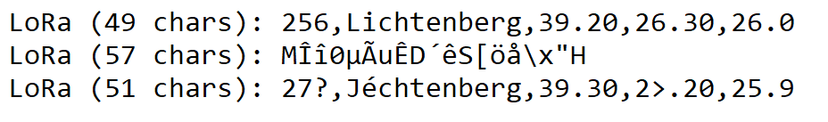

## ESP32
- Sometimes, using different adapter (i.e, USB C-A adapter) will report different name for the plugged device. This is easy to observe by plugging a ESP32 into a normal adapter vs Apple USB C to HDMI and USB A adapter.
- Opening multiple PlatformIO windows for the same hardware might be tricky if 2 windows want to access the same device.

## LoRa
- There are problems caused by interference and sharing of spectrum:

    
    

