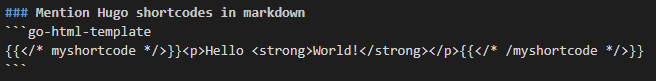

+++
title = "Writing with Hugo"
date = "30/11/2022"
description = "Syntax and note on working with Hugo"
+++


### Latex

```tex
% The following
$$\int_{a}^{b} x^2 dx$$
% Is an integral
```
$$\int_{a}^{b} x^2 dx$$

### Image
Create a folder in `posts` dir with `index.md` file for content. Copy images into the folder. Ref with:

```md
[nature](nature.jpg)
```
or
```html
<div style="align: left; text-align:center;">
    
    <span style="display:block;">This is a centered resized image</span>
</div>
```

<div style="align: left; text-align:center;">
    
    <span style="display:block;">This is a centered resized image</span>
</div>

### Mention Hugo shortcodes in markdown
```go-html-template
<p>Hello <strong>World!</strong></p>
```
<div style="align: left; text-align:center;">
    
    <!-- <span style="display:block;">This is a centered resized image</span> -->
</div>