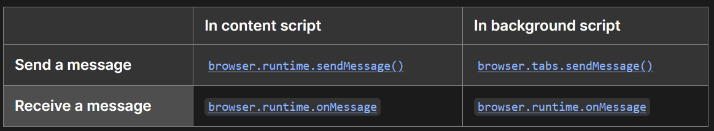

# Snippets

## Communication between plugin's component:
Usually a simple plugin will have `background.js`, `content.js` and `manifest.json` scripts.
More sophisticated features will require other components: `popup.js`, `sidebar.js`.
To handle communication and signaling between them, we have 2 main options: `normal message` (one-off), and `port message` (connection-based).

### One-off messages

Sending and receiving message is relative confusing:

<div style="align: left; text-align:center;">
    
    <span style="display:block;"><a href="https://developer.mozilla.org/en-US/docs/Mozilla/Add-ons/WebExtensions/Content_scripts#one-off_messages">Communication APIs()</a></span>
</div>

This method is suitable for 1-time message.

### Connection-based messaging
The following code illustrate how to initiate connection between background, content and sidebar script.
Although direct connection can be made, I usually let background script do the message forwarding between content script and sidebar script.

Background script:
```js
let portChannelContent;
let portChannelSidebar;
function connected(p) {
  if (p && p.name === "port-cs") {
    portChannelContent = p;
    portChannelContent.onMessage.addListener((message, sender) => {
        if (message.reference === "cs-ref-1") {
            // LOGIC here
        }
    })
  } else if (p && p.name === "port-sidebar") {
    portChannelSidebar = p;
    portChannelSidebar.onMessage.addListener((message, sender) => {
        if (message.reference === "port-ref-1") {
            // LOGIC here
        }
    })
  }
}

browser.runtime.onConnect.addListener(connected);
```

Content script:
```js
let contentPort = browser.runtime.connect({ name: "port-cs" });
contentPort.onMessage.addListener((message) => {
    //
})
```

Sidebar:
```js
portSidebar = browser.runtime.connect({ name: "port-sidebar" });
portSidebar.onMessage.addListener((message) => {
    //
})
```

## Screenshot
Making screenshot is a security risk, therefore there is not much offered by browser. 
For plugin, we can use [tabs.captureVisibleTab](https://developer.mozilla.org/en-US/docs/Mozilla/Add-ons/WebExtensions/API/tabs/captureVisibleTab) to capture the whole screen, or part of it from background script.
The data can then be transfered to content script using message channels.

**CS** ---(`DOM position: x, y, width, height`)---> **BG** (`tabs.captureVisibleTab`) ---(`dataURL PNG`)---> **CS**

Background script:
```js
if (message.reference == "capture") {
    let result = [];
    
    function captureAndPush(rect) {
        const imageDetails = { format: "png", quality: 100, rect: rect, scale: 1.0 };
        return browser.tabs.captureVisibleTab(imageDetails)
        .then((dataUrl) => {
            result.push(dataUrl);
            console.log(dataUrl);
        });
    }
    // imgSources is an array holds size and position of DOMs
    Promise.all(message.message.imgSources.map(captureAndPush))
        .then(() => {
        // Once all captures are complete, send the result to the sidebar
        portChannelContent.postMessage({
            info: "ext", reference: "responsePickedItems",
            source: "chupmu_background_script", target: "chupmu_content_script",
            message: {"capturedPng": result},
        });
        })
        .catch((error) => {
        console.error("Error capturing DOM screenshots:", error);
        });
}

```

Content script (sending DOM position):
```js
let imgSources = [];
pickedElements.forEach(element => {
    // Get position of the selected elements and send to Background to make screenshot
    let domRect = element.getBoundingClientRect();
    // https://developer.mozilla.org/en-US/docs/Mozilla/Add-ons/WebExtensions/API/extensionTypes/ImageDetails
    // This way we get the position of DOM relatively to the whole page
    let rect = {
        x: domRect.x + document.documentElement.scrollLeft, 
        y: domRect.y + document.documentElement.scrollTop, 
        width: domRect.width, height: domRect.height
    };
    imgSources.push(rect);
})
myPort.postMessage({
    info: "ext", reference: "responsePickedItems",
    source: "chupmu_content_script", target: "chupmu_background_script",
    message: { "imgSources": imgSources }
})
```